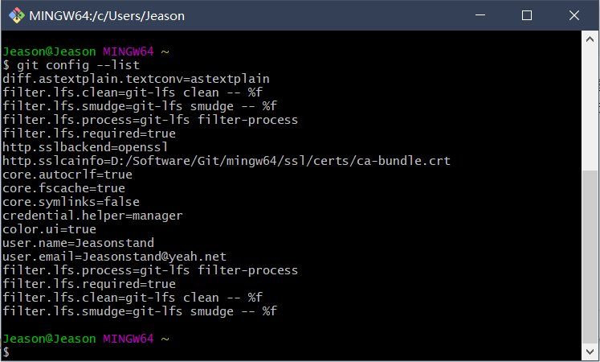
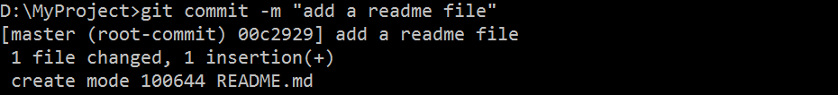

# Git 安装配置

​		Git可以在windows、Mac、Linux全平台系统使用。登录 https://git-scm.com/downloads 下载你系统的Git软件并进行安装。

## 一、安装

### Windows 平台上安装Git

​		在 Windows 平台上安装 Git 同样轻松，有个叫做 msysGit 的项目提供了安装包，可以到 GitHub 的页面上下载 exe 安装文件并运行：

​		安装包下载地址：https://gitforwindows.org/

​		安装一路“Next”默认安装即可。

​		安装完成后，在开始菜单里找到“Git”->“Git Bash”，通过以下命令查看，如果显示版本号那就是安装成功了！

```
git --version
```


### Linux 平台上安装Git

> 请确保你的 Linux 操作系统可以正常联网，并你已经会使用 Vim 或 Emacs 编辑器。

​		Git 的工作需要调用 curl，zlib，openssl，expat，libiconv 等库的代码，所以需要先安装这些依赖工具。

各 Linux 系统可以使用其安装包管理工具（apt-get、yum 等）,切换到 root 用户，并执行下边语句进行安装：

- #### Debian/Ubuntu

  ​	Debian/Ubuntu Git 安装命令为：

```
$ apt-get install git

$ git --version
git version 2.24.1
```


- #### Centos/RedHat

  ​	Centos/RedHat 安装命令为：

```
$ yum -y install git-core

$ git --version
git version 2.24.1
```


- #### **Gentoo**

  ​	Gentoo安装命令为：

```
$ emerge --ask --verbose dev-vcs/git
```


- #### **Arch Linux**

  ​	Arch Linux安装命令为：

```
$ pacman -S git
```


- #### **openSUSE**

  ​	openSUSE安装命令为：

```
$ zypper install git
```


- #### **FreeBSD**

  ​	FreeBSD安装命令为：

```
$ cd /usr/ports/devel/git

$ make install
```


- #### **Solaris 11 Express**

  ​	Solaris 11 Express安装命令为：

```
$ pkg install developer/versioning/git
```


- #### **OpenBSD**

  ​	OpenBSD安装命令为：

```
$ pkg_add git
```


- #### 源码安装

  ​	我们也可以在官网下载源码包来安装，最新源码包下载地址：https://git-scm.com/download

安装指定系统的依赖包：

```
########## Centos/RedHat ##########
$ yum install curl-devel expat-devel gettext-devel \
  openssl-devel zlib-devel

########## Debian/Ubuntu ##########
$ apt-get install libcurl4-gnutls-dev libexpat1-dev gettext \
  libz-dev libssl-dev
```

​		解压安装下载的源码包：

```
$ tar -zxf git-1.7.2.2.tar.gz
$ cd git-1.7.2.2
$ make prefix=/usr/local all
$ sudo make prefix=/usr/local install
```


### Mac OS X上安装Git

###### 	***三种安装Git的方法:***

​		**一、**常规下载安装

​	1. 下载Git，地址- ->> [https://git-scm.com/download/mac](https://git-scm.com/download/win)

> （通常进入上边链接后浏览器会自动下载，否则请点击红框链接手动下载）

​	2. 双击下载完的安装包，一路“Next”默认安装即可。


​		**二、**安装homebrew，然后通过homebrew安装Git，具体方法请参考homebrew的文档：http://brew.sh/。


​		**三、**直接从AppStore安装Xcode，Xcode集成了Git，不过默认没有安装，需要运行Xcode，选择菜单“Xcode”->“Preferences”，在弹出窗口中找到“Downloads”，选择“Command Line Tools”，点“Install”就可以完成安装了。

​		Xcode是Apple官方IDE，功能非常强大，是开发Mac和iOS App的必选装备，而且是免费的！


## 二、配置

### 		初始配置

​		配置文件为 `~/.gitconfig` ，执行任何Git配置命令后文件将自动创建。

第一个要配置的是你个人的用户名称和电子邮件地址。这两条配置很重要，每次 Git 提交时都会引用这两条信息，说明是谁提交了更新，所以会随更新内容一起被永久纳入历史记录：

​		在命令行输入：

```
$ git config --global user.name "Your Name"
$ git config --global user.email "email@example.com"
```

​		注意`git config`命令的`--global`参数，用了这个参数，表示你这台机器上所有的Git仓库都会使用这个配置，当然也可以对某个仓库指定不同的用户名和Email地址。


使用 git config --list 命令可以查看信息是否写入成功：




### 初始化Git

1、在 D 盘新建一个叫做 MyProject 的新文件夹（这里你可以自己找个位置实验，但路径中尽量不要出现中文符号）。

2、将命令行窗口的工作路径切换到刚才创建的 MyPorject 中，输入命令 git init 即可初始化 Git。

3、看到 MyProject 文件夹中出现一个叫做 .git 的隐藏文件（这个文件夹就是 Git 用来跟踪管理版本迭代的）：

> 如看不到，点击【查看】，勾选“隐藏的项目”。

4、写任何大项目之前，先要写一个 README.md 的文档（md 后缀是 Markdown 语言写的文本）


##### 将文件添加到暂存区域

1、回到命令行窗口，输入 git add README.md 命令：

2、现在已经将 README.md 这个文件放入暂存区域了。


##### **将文件提交到 Git 仓库**

1、输入 git commit -m "add a readme file" 将暂存区域里的东西提交到 Git 仓库中：



2、Git 告诉你有 1 个文件被改动（README.md）

> commit 是提交的意思，-m 选项后边跟着的是本次提交的说明，就是大概描述这一版本做了哪些改动，以便今后可以迅速查看。

> *需要注意的是：对于这个提交的说明，Git 是强制要求你必须写的。如果没有使用 -m 选项，Git 会自动打开一个编辑器，要求你在其中输入提交说明，输入完毕后保存退出即可（操作命令与 vim 编辑器一致）。*


总结一下，将工作目录的文件放到 Git 仓库只需要两步：

 Step One -> git add 文件名

 Step Two -> git commit -m "你干了啥"