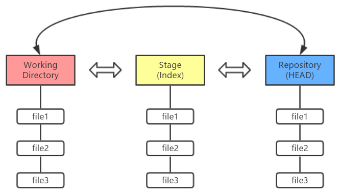

# Git 工作区、暂存区和版本库

## 基本概念

### **工作区（Working Directory）：**

> ###### 就是你在电脑里能看到的目录。

工作区有一个隐藏目录`.git`，这个不算工作区，而是Git的版本库。

### 暂存区（stage/index）：

> ###### 一般存放在 ".git目录下" 下的index文件（.git/index）中，所以我们把暂存区有时也叫作索引（index）。

### **版本库（Repository）：**

> ###### 工作区有一个隐藏目录.git，这个不算工作区，而是Git的版本库。

Git的版本库里存了很多东西，其中最重要的就是称为stage（或者叫index）的暂存区，还有Git为我们自动创建的第一个分支`master`，以及指向`master`的一个指针叫`HEAD`。

Git 的工作流程一般是酱紫：

1. ​	在工作目录中添加、修改文件；
2. ​    将需要进行版本管理的文件放入暂存区域；
3. ​    将暂存区域的文件提交到 Git 仓库。

 因此，Git 管理的文件有三种状态：已修改（modified）、已暂存（staged）和已提交（committed），依次对应上边的每一个流程。

我们把文件往Git版本库里添加的时候，是分两步执行的：

第一步是用`git add`把文件添加进去，实际上就是把文件修改添加到暂存区；

第二步是用`git commit`提交更改，实际上就是把暂存区的所有内容提交到当前分支。

因为我们创建Git版本库时，Git自动为我们创建了唯一一个`master`分支，所以，现在，`git commit`就是往`master`分支上提交更改。

### **查看状态**

------

 随时随地，你都可以使用 `git status` 命令查看当前的状态……

 上一讲的代码如果你没有动过，那么输入 `git status` 命令后应该是下边这样：